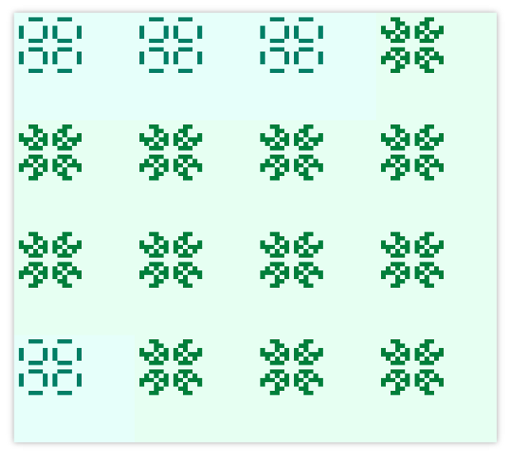

## Distributed Game of Life - A WebSocket stress tester

The [Game of Life](http://en.wikipedia.org/wiki/Conway's_Game_of_Life) is a simple cellular automaton. It's a grid of square cells, each of which is in one of the two possible states: alive or dead. At each step in time, every cell checks its eight neighbours and updates its own state according to the following rules:

  * Any live cell with fewer than two live neighbours dies, as if caused by under-population.
  * Any live cell with two or three live neighbours lives on to the next generation.
  * Any live cell with more than three live neighbours dies, as if by overcrowding.
  * Any dead cell with exactly three live neighbours becomes a live cell, as if by reproduction.

All cells are updated simultaneously according to those rules at each step in time.

The simulation can easily be distributed since each cell can update its status by looking only at its immediate neighbours. A server can coordinate a big board by assigning each client a quadrant of the board. The clients update their cells and send the result to the server. In turn, they recieve the status of their neighbours. To update the edge cells of the quadrant, each client needs the status of its neighbouring clients.

The server coordinates the startup sequence and relays messages between clients, but it doesn't know anything about the rules of the game (except that neighbours need to be relayed messages between each other); all the simulation logic is independently handled by the clients!

The browser registers to receive updates from all clients, and updates in real time as soon as the workers start running. The browser is the only client with knowledge of the whole board. Every worker client only knows and updates his own board and receives updates from its neighbours.

## Usage

You need Java 6+ and [RingoJs](http://ringojs.org/download).

Start server and clients with default settings:

    ringo app/main.js --server
    ringo app/main.js --clients

And watch live update of the whole board in your browser: [http://localhost:8080/](http://localhost:8080/)

Alive cells are dark, dead cells are light. The quadrants hue shifts slightly at each time step to show how the grid updates across all workers.

### Options to play around with

Use `--size` to change the width and height of the whole board and `--clientsize` for the size of the quadrant one client calculates. For example, for a 80x80 board with 4x4 cells per client (that's 400 clients!):

    ringo app/main.js --server --size 80 --clientsize 4
    ringo app/main.js --clients

The `--debug` option is harmless on the server but beware enabling it for the clients.

Load a pattern from the [patterns directory](./patterns/) and speed up the simulation:

    ringo app/main.js --clients --pattern pulsar --speed 0.5

Make sure the pattern isn't bigger than a client's square or you'll get an exception.

## About

`--server` starts a Jetty 7 [WebSocketServlet](http://download.eclipse.org/jetty/7.6.14.v20131031/apidocs/org/eclipse/jetty/websocket/WebSocketServlet.html) and `--clients` uses Jetty's [WebSocketClient](http://download.eclipse.org/jetty/stable-7/apidocs/org/eclipse/jetty/websocket/WebSocketClient.html) to connect to the server.

I used [RingoJs](http://ringojs.org/) because it already wraps a big part of Jetty for scripting with JavaScript; and I get tools to write threaded JavaScript or at least deal with libraries which do use threads (as do both Jetty and the WebSocketClientFactory).

    -----------------------------------------------
    Language                     files     code
    -----------------------------------------------
    Javascript                       3     477
    Javascript (browser)             1    ~ 50
    HTML                             1     102
    -----------------------------------------------

Fun fact: the four elaborate rules from the opening paragraph boil down to this in code:

    nextState = (liveNeighbours == 3  || (state == true && liveNeighbours == 2));

And another interesting aspect of the simulation is that parts of the board can be one (and only one) time step ahead of the rest of the board: each client can calculate step N+1 after having recieved step N from all its 8 neighbours. And at each step, one client will be the first to have received all 8 neighbours. At which point this lucky client client can already calculate and send out step N+1. This interesting tidbit is handled in the code by indexing `GofClient.prototype.receivedBoards` by `step%2` which makes sure a client can hold two board states from each neighbour: one board for the current step the client is currently in and collecting updates for, and one board for the next step.

## License

Inspired by django's c10k playground implementation of GoL: https://github.com/aaugustin/django-c10k-demo.

Copyright (c) 2014 Simon Oberhammer.
Copyright (c) 2013 Aymeric Augustin.
All rights reserved.

Redistribution and use in source and binary forms, with or without
modification, are permitted provided that the following conditions are met:

    * Redistributions of source code must retain the above copyright notice,
      this list of conditions and the following disclaimer.
    * Redistributions in binary form must reproduce the above copyright notice,
      this list of conditions and the following disclaimer in the documentation
      and/or other materials provided with the distribution.
    * Neither the name of django-sesame nor the names of its contributors may
      be used to endorse or promote products derived from this software without
      specific prior written permission.

THIS SOFTWARE IS PROVIDED BY THE COPYRIGHT HOLDERS AND CONTRIBUTORS "AS IS" AND
ANY EXPRESS OR IMPLIED WARRANTIES, INCLUDING, BUT NOT LIMITED TO, THE IMPLIED
WARRANTIES OF MERCHANTABILITY AND FITNESS FOR A PARTICULAR PURPOSE ARE
DISCLAIMED. IN NO EVENT SHALL THE COPYRIGHT HOLDER OR CONTRIBUTORS BE LIABLE
FOR ANY DIRECT, INDIRECT, INCIDENTAL, SPECIAL, EXEMPLARY, OR CONSEQUENTIAL
DAMAGES (INCLUDING, BUT NOT LIMITED TO, PROCUREMENT OF SUBSTITUTE GOODS OR
SERVICES; LOSS OF USE, DATA, OR PROFITS; OR BUSINESS INTERRUPTION) HOWEVER
CAUSED AND ON ANY THEORY OF LIABILITY, WHETHER IN CONTRACT, STRICT LIABILITY,
OR TORT (INCLUDING NEGLIGENCE OR OTHERWISE) ARISING IN ANY WAY OUT OF THE USE
OF THIS SOFTWARE, EVEN IF ADVISED OF THE POSSIBILITY OF SUCH DAMAGE.

